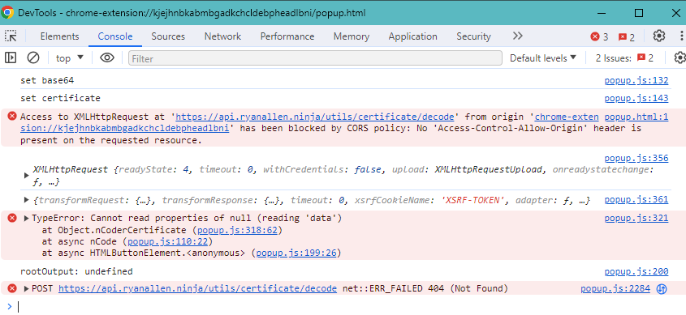
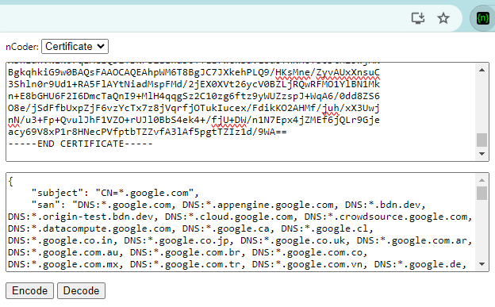

## nCode Chrome Extension

As mentioned in [Playing With Certs](./Playing-With-Certs.md), I had found a defunct Google Chrome extension. [nCode](https://chromewebstore.google.com/detail/ncode/kjejhnbkabmbgadkchcldebpheadlbni) is an extension that handles various encoding/decoding options, the PEM Certificate decoding being of primary interest.

The Certificate input looks like so:


It's straightforward enough: You enter your PEM-encoded certificate, click Decode, and the output field should populate with your certificate details. When I first tried, rather than being greeted by certificate details, I instead saw "undefined." What was going on here? My certificate was a valid and well-formed, there *should* be no reason for it to not work. I had to do some digging.

 The extension page had a link to the [source code](https://github.com/garrettgrimsley/nCode/tree/master) on GitHub, and reading through it led me to this snippet:

```javascript
async function apiCertDecode(input) {
    ...
    response = await axios.post('https://api.ryanallen.ninja/utils/certificate/decode', input).catch(function (error) {
```

So, nCode is making a call out to the developer's backend to handle the decode, rather than doing it locally. Had I not found the code on GitHub, I could have reached the same conclusion by using the Inspect Popup functionality to view the Console output and Network traffic generated by nCode. 



Note that these screenshots may not be *exactly* what I saw, but the convey the point. I've since registered the backend domain and pointed it to my own host, so the errors may have differed prior to then.


From this point, I checked to see why the requests were failing, including trying to ping the `api.ryanallen.ninja` site. Nothing came back, so I checked to see if the domain was registered, and registered it as it was not.

I ended up writing a barebones endpoint on [Netlify](https://www.netlify.com/) which gave me HTTPS and 125,000 free function invocations per month.

```typescript
const handler: Handler = async (event: HandlerEvent, context: HandlerContext) => {
  const cert = new crypto.X509Certificate(event.body);

  const body = {"subject": cert.subject, "san": cert.subjectAltName, "validFrom": cert.validFrom, "validTo": cert.validTo, "serialNumber": cert.serialNumber}
  return {
      headers: {
      "Access-Control-Allow-Origin": "*",
      "Origin": "*"
      },
    statusCode: 200,
    body: JSON.stringify(body)
  };
};
```

Once that was in place, I gave it a whirl:  



## Certificate Encoding & Decoding

I've since lost the collection of articles I read while researching how to turn a PEM-encoded certificate into human-readable text, but it should suffice to say that I'm exceptionally grateful that the [Crypto](https://nodejs.org/api/crypto.html#crypto) module exists. Sticking with the example Google.com certificate, let's briefly look at what's going on under the hood.  
PEM Encoded Google.com Certificate:
```
-----BEGIN CERTIFICATE-----
MIIOXjCCDUagAwIBAgIRAJKc339ZwIrpCZuMyXFusEowDQYJKoZIhvcNAQELBQAw
RjELMAkGA1UEBhMCVVMxIjAgBgNVBAoTGUdvb2dsZSBUcnVzdCBTZXJ2aWNlcyBM
TEMxEzARBgNVBAMTCkdUUyBDQSAxQzMwHhcNMjQwMTI5MDgwNDQ3WhcNMjQwNDIy
MDgwNDQ2WjAXMRUwEwYDVQQDDAwqLmdvb2dsZS5jb20wWTATBgcqhkjOPQIBBggq
hkjOPQMBBwNCAASB6wVGdBTGrYTNLOgcSDG0+J3gPo8rFeHbl1W+ZIBjbbIlAbGt
cHWlO5LiWvX/9Ra4EykTj2Z2HH1qM2RuWespo4IMPzCCDDswDgYDVR0PAQH/BAQD
AgeAMBMGA1UdJQQMMAoGCCsGAQUFBwMBMAwGA1UdEwEB/wQCMAAwHQYDVR0OBBYE
FJDWIvFi4WYw5Ts43/kaYiM+0kSvMB8GA1UdIwQYMBaAFIp0f6+Fze6VzT2c0OJG
FPNxNR0nMGoGCCsGAQUFBwEBBF4wXDAnBggrBgEFBQcwAYYbaHR0cDovL29jc3Au
cGtpLmdvb2cvZ3RzMWMzMDEGCCsGAQUFBzAChiVodHRwOi8vcGtpLmdvb2cvcmVw
by9jZXJ0cy9ndHMxYzMuZGVyMIIJ7wYDVR0RBIIJ5jCCCeKCDCouZ29vZ2xlLmNv
bYIWKi5hcHBlbmdpbmUuZ29vZ2xlLmNvbYIJKi5iZG4uZGV2ghUqLm9yaWdpbi10
ZXN0LmJkbi5kZXaCEiouY2xvdWQuZ29vZ2xlLmNvbYIYKi5jcm93ZHNvdXJjZS5n
b29nbGUuY29tghgqLmRhdGFjb21wdXRlLmdvb2dsZS5jb22CCyouZ29vZ2xlLmNh
ggsqLmdvb2dsZS5jbIIOKi5nb29nbGUuY28uaW6CDiouZ29vZ2xlLmNvLmpwgg4q
Lmdvb2dsZS5jby51a4IPKi5nb29nbGUuY29tLmFygg8qLmdvb2dsZS5jb20uYXWC
DyouZ29vZ2xlLmNvbS5icoIPKi5nb29nbGUuY29tLmNvgg8qLmdvb2dsZS5jb20u
bXiCDyouZ29vZ2xlLmNvbS50coIPKi5nb29nbGUuY29tLnZuggsqLmdvb2dsZS5k
ZYILKi5nb29nbGUuZXOCCyouZ29vZ2xlLmZyggsqLmdvb2dsZS5odYILKi5nb29n
bGUuaXSCCyouZ29vZ2xlLm5sggsqLmdvb2dsZS5wbIILKi5nb29nbGUucHSCDyou
Z29vZ2xlYXBpcy5jboIRKi5nb29nbGV2aWRlby5jb22CDCouZ3N0YXRpYy5jboIQ
Ki5nc3RhdGljLWNuLmNvbYIPZ29vZ2xlY25hcHBzLmNughEqLmdvb2dsZWNuYXBw
cy5jboIRZ29vZ2xlYXBwcy1jbi5jb22CEyouZ29vZ2xlYXBwcy1jbi5jb22CDGdr
ZWNuYXBwcy5jboIOKi5na2VjbmFwcHMuY26CEmdvb2dsZWRvd25sb2Fkcy5jboIU
Ki5nb29nbGVkb3dubG9hZHMuY26CEHJlY2FwdGNoYS5uZXQuY26CEioucmVjYXB0
Y2hhLm5ldC5jboIQcmVjYXB0Y2hhLWNuLm5ldIISKi5yZWNhcHRjaGEtY24ubmV0
ggt3aWRldmluZS5jboINKi53aWRldmluZS5jboIRYW1wcHJvamVjdC5vcmcuY26C
EyouYW1wcHJvamVjdC5vcmcuY26CEWFtcHByb2plY3QubmV0LmNughMqLmFtcHBy
b2plY3QubmV0LmNughdnb29nbGUtYW5hbHl0aWNzLWNuLmNvbYIZKi5nb29nbGUt
YW5hbHl0aWNzLWNuLmNvbYIXZ29vZ2xlYWRzZXJ2aWNlcy1jbi5jb22CGSouZ29v
Z2xlYWRzZXJ2aWNlcy1jbi5jb22CEWdvb2dsZXZhZHMtY24uY29tghMqLmdvb2ds
ZXZhZHMtY24uY29tghFnb29nbGVhcGlzLWNuLmNvbYITKi5nb29nbGVhcGlzLWNu
LmNvbYIVZ29vZ2xlb3B0aW1pemUtY24uY29tghcqLmdvb2dsZW9wdGltaXplLWNu
LmNvbYISZG91YmxlY2xpY2stY24ubmV0ghQqLmRvdWJsZWNsaWNrLWNuLm5ldIIY
Ki5mbHMuZG91YmxlY2xpY2stY24ubmV0ghYqLmcuZG91YmxlY2xpY2stY24ubmV0
gg5kb3VibGVjbGljay5jboIQKi5kb3VibGVjbGljay5jboIUKi5mbHMuZG91Ymxl
Y2xpY2suY26CEiouZy5kb3VibGVjbGljay5jboIRZGFydHNlYXJjaC1jbi5uZXSC
EyouZGFydHNlYXJjaC1jbi5uZXSCHWdvb2dsZXRyYXZlbGFkc2VydmljZXMtY24u
Y29tgh8qLmdvb2dsZXRyYXZlbGFkc2VydmljZXMtY24uY29tghhnb29nbGV0YWdz
ZXJ2aWNlcy1jbi5jb22CGiouZ29vZ2xldGFnc2VydmljZXMtY24uY29tghdnb29n
bGV0YWdtYW5hZ2VyLWNuLmNvbYIZKi5nb29nbGV0YWdtYW5hZ2VyLWNuLmNvbYIY
Z29vZ2xlc3luZGljYXRpb24tY24uY29tghoqLmdvb2dsZXN5bmRpY2F0aW9uLWNu
LmNvbYIkKi5zYWZlZnJhbWUuZ29vZ2xlc3luZGljYXRpb24tY24uY29tghZhcHAt
bWVhc3VyZW1lbnQtY24uY29tghgqLmFwcC1tZWFzdXJlbWVudC1jbi5jb22CC2d2
dDEtY24uY29tgg0qLmd2dDEtY24uY29tggtndnQyLWNuLmNvbYINKi5ndnQyLWNu
LmNvbYILMm1kbi1jbi5uZXSCDSouMm1kbi1jbi5uZXSCFGdvb2dsZWZsaWdodHMt
Y24ubmV0ghYqLmdvb2dsZWZsaWdodHMtY24ubmV0ggxhZG1vYi1jbi5jb22CDiou
YWRtb2ItY24uY29tghRnb29nbGVzYW5kYm94LWNuLmNvbYIWKi5nb29nbGVzYW5k
Ym94LWNuLmNvbYIeKi5zYWZlbnVwLmdvb2dsZXNhbmRib3gtY24uY29tgg0qLmdz
dGF0aWMuY29tghQqLm1ldHJpYy5nc3RhdGljLmNvbYIKKi5ndnQxLmNvbYIRKi5n
Y3BjZG4uZ3Z0MS5jb22CCiouZ3Z0Mi5jb22CDiouZ2NwLmd2dDIuY29tghAqLnVy
bC5nb29nbGUuY29tghYqLnlvdXR1YmUtbm9jb29raWUuY29tggsqLnl0aW1nLmNv
bYILYW5kcm9pZC5jb22CDSouYW5kcm9pZC5jb22CEyouZmxhc2guYW5kcm9pZC5j
b22CBGcuY26CBiouZy5jboIEZy5jb4IGKi5nLmNvggZnb28uZ2yCCnd3dy5nb28u
Z2yCFGdvb2dsZS1hbmFseXRpY3MuY29tghYqLmdvb2dsZS1hbmFseXRpY3MuY29t
ggpnb29nbGUuY29tghJnb29nbGVjb21tZXJjZS5jb22CFCouZ29vZ2xlY29tbWVy
Y2UuY29tgghnZ3BodC5jboIKKi5nZ3BodC5jboIKdXJjaGluLmNvbYIMKi51cmNo
aW4uY29tggh5b3V0dS5iZYILeW91dHViZS5jb22CDSoueW91dHViZS5jb22CFHlv
dXR1YmVlZHVjYXRpb24uY29tghYqLnlvdXR1YmVlZHVjYXRpb24uY29tgg95b3V0
dWJla2lkcy5jb22CESoueW91dHViZWtpZHMuY29tggV5dC5iZYIHKi55dC5iZYIa
YW5kcm9pZC5jbGllbnRzLmdvb2dsZS5jb22CG2RldmVsb3Blci5hbmRyb2lkLmdv
b2dsZS5jboIcZGV2ZWxvcGVycy5hbmRyb2lkLmdvb2dsZS5jboIYc291cmNlLmFu
ZHJvaWQuZ29vZ2xlLmNughpkZXZlbG9wZXIuY2hyb21lLmdvb2dsZS5jboIYd2Vi
LmRldmVsb3BlcnMuZ29vZ2xlLmNuMCEGA1UdIAQaMBgwCAYGZ4EMAQIBMAwGCisG
AQQB1nkCBQMwPAYDVR0fBDUwMzAxoC+gLYYraHR0cDovL2NybHMucGtpLmdvb2cv
Z3RzMWMzL2ZWSnhiVi1LdG1rLmNybDCCAQQGCisGAQQB1nkCBAIEgfUEgfIA8AB2
AO7N0GTV2xrOxVy3nbTNE6Iyh0Z8vOzew1FIWUZxH7WbAAABjVR22GQAAAQDAEcw
RQIgaMs2STzQvpget1kxnD5BbCnUbICpn9OdretQ7jztpvoCIQDjsx9FfWTBvgan
EeP22tBgim0kM0lMsvFcTEA7jiMm9gB2ANq2v2s/tbYin5vCu1xr6HCRcWy7UYSF
NL2kPTBI1/urAAABjVR22XAAAAQDAEcwRQIgKQr8E01kkPIOXM78+AG0vgck4Rsr
XBhldhVklk07qIACIQD2YSkFsZEEha30Y+LE7wckBuVLod5fRNH6Yb6DtHZ3wjAN
BgkqhkiG9w0BAQsFAAOCAQEAhpWM6T8BgJC7JXkehPLQ9/HKsMne/ZyvAUxXnsuC
3Shln0r9Ud1+RA5FlAYtNiadMspFMd/2jEX0XVt26ycV0BZLjRQwRFMO1YlBN1Mk
n+E8bGHU6F2I6DmcTaQnI9+MlH4qqgSz2C10zg6ftz9yWUZzspJ+WqA6/0dd8ZS6
O8e/jSdFfbUxpZjF6vzYcTx7z8jVqrfjOTukIucex/FdikKO2AHMf/juh/xX3Uwj
nN/u3+Fp+QvulJhF1VZO+rUJl0BbS4ek4+/fjU+DW/n1N7Epx4jZMEf6jQLr9Gje
acy69V8xP1r8HNecPVfptbTZZvfA3lAf5pgtTZIz1d/9WA==
-----END CERTIFICATE-----
```

If you don't recognize the blob of text, it's base64-encoded data. The `==` and the end of the blob is one dead giveaway, it is padding as defined in [RFC 4648](https://datatracker.ietf.org/doc/html/rfc4648#section-4), which establishes the Base64 encoding standard. This is mandated by [RFC 7468](https://datatracker.ietf.org/doc/html/rfc7468#section-5), which relates to certificate encoding. It says that "The encoded data MUST be a BER...encoded ASN.1 Certificate structure..." which brings us to [Abstract Syntax Notation One](https://en.wikipedia.org/wiki/ASN.1). Borrowing from Wikipedia, "ASN.1 is a standard interface description language (IDL, think Protobuf or OpenAPI spec) for defining data structures that can be serialized and deserialized in a cross-platform way."  
For our purposes, it means that when we try to run a Base64-decode on the certifacte in Notepad++, we get this:

So, what is going on here? Why can't we read *all* of the text? Our text editor is treating all of the content as [UTF-8](https://en.wikipedia.org/wiki/UTF-8) encoded text. There it is again, *encoding*. In short, the text editor is trying to decode the data according to the [UTF-8 specification](https://datatracker.ietf.org/doc/html/rfc3629), rather than the BER encoded ASN.1 Certificate structure, known as [X.509](https://en.wikipedia.org/wiki/X.509). Referring to the X.509 spec, we are going to drill down into lines 8 and 9 of the text `240129080447Z` which I suspect are timestamps. 

Starting at [Basic Certificate Fields](https://www.rfc-editor.org/rfc/rfc5280#section-4.1), we read the spec like so:

```
TitleAndName ::= Is Composed Of {
    title       BIT STRING,
    name        Name
}

Name ::= Is Composed Of {
    firstName   BIT STRING,
    lastName    BIT STRING
}
```

Bit String is an example of a [built-in type](https://obj-sys.com/asn1tutorial/node10.html) in ASN.1. You don't need to remember those. When you read the above example, it should work out like this:  
* TitleAndName
  * Title (Bit String)
  * Name
    * firstName (Bit String)
    * lastName (Bit String)

We will exclude irrelevant fields for clarity.

```
Certificate  ::=  SEQUENCE  {
        tbsCertificate       TBSCertificate
        }

TBSCertificate  ::=  SEQUENCE  {
        validity             Validity
        }

Validity ::= SEQUENCE {
        notBefore      Time,
        notAfter       Time }

Time ::= CHOICE {
        utcTime        UTCTime,
        generalTime    GeneralizedTime }
```
At this point we have, as it says, a CHOICE between UTCTime and GeneralizedTime. According to the spec, certificate validity dates through the year 2049 *must* be encoded as UTCTime. Thankfully, [UTCTime](https://obj-sys.com/asn1tutorial/node15.html) is built into ASN.1 as such: 'UTCTime values take the form of either "YYMMDDhhmm[ss]Z" or...' Z being [Zulu](https://en.wikipedia.org/wiki/Coordinated_Universal_Time#Time_zones:~:text=The%20time%20zone%20using,flying%20between%20time%20zones) time.

So, more legibly(?):  
* Certificate
  * TBSCertificate
    * validity
      * notBefore (UTCTime)
      * notAfter (UTCTime)

```
240129080447Z
240422080446Z
```
translates to:
```
notBefore: 2024-01-29 08:04:47Z
notAfter: 2024-04-22 08:04:46Z
```

Returning to nCode, when we decode the certifacte, we see the following:


All of that and more is possible with little effort on our part thanks to the dozens [contributors](#crypto-contributors) to the Crypto module of nodejs. Much appreciation to all of them.

In a future post, I'll go into detail about what *exactly* these unreadable bits are:


### Sources:  
* [ASN.1](https://en.wikipedia.org/wiki/ASN.1)
* [X.690](https://en.wikipedia.org/wiki/X.690)
* [X.509](https://en.wikipedia.org/wiki/X.509)
* [UTF-8](https://en.wikipedia.org/wiki/UTF-8)
* [Coordinated Universal Time](https://en.wikipedia.org/wiki/Coordinated_Universal_Time)
* [PEM (Privacy Enhanced Mail)](https://en.wikipedia.org/wiki/Privacy-Enhanced_Mail)
* [Certificate and Certificate Extensions Profile](https://datatracker.ietf.org/doc/html/rfc5280#section-4)
* [Explanation of certificate container formats](https://serverfault.com/a/9717)
* [Interface Description Language](https://en.wikipedia.org/wiki/Interface_description_language)

#### Crypto Contributors:
To pull the full list of contributors, run the following commands
```bash
git clone https://github.com/nodejs/node.git
cd lib/internal/
git shortlog --numbered --summary crypto
```
and you should see something like so:
```
    69  Tobias Nießen
    68  Filip Skokan
    21  James M Snell
    20  Antoine du Hamel
    15  Daniel Bevenius
    15  Ruben Bridgewater
```